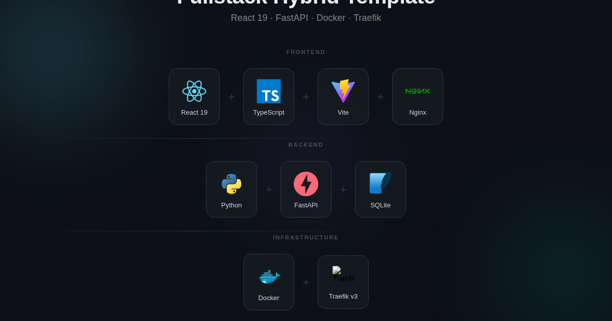

# 🚀 Fullstack Hybrid Template

<p align="center">
  
</p>

<p align="center">
  <strong>Un template production-ready pour construire des apps web modernes.</strong><br>
  React 19 Compiler · FastAPI · Docker · Traefik · AI Agent Skills intégrés.
</p>

<p align="center">
  <a href="#-quickstart">Quickstart</a> ·
  <a href="#-stack-technique">Stack</a> ·
  <a href="#-déploiement">Déploiement</a> ·
  <a href="#-agent-skills">AI Skills</a> ·
  <a href="how_to_use_repo.md">Guide méthodologique</a>
</p>

---

## Pourquoi ce template ?

Tu perds 2-3 jours à setup un nouveau projet : Docker, Traefik, CORS, auth, CI/CD, les rules Cursor... **Ce template fait tout ça en 5 minutes.**

- **Fork → Deploy → Running.** Un seul message à ton agent OpenClaw et ton app est live.
- **15+ AI Skills intégrés.** TDD, diagnose, grill sessions, caveman mode — pas juste des rules Cursor, une vraie méthodologie de développement.
- **Zero-config auth.** Google OAuth via Traefik ForwardAuth. Pas de gestion de mots de passe dans ton code.
- **React Compiler.** Fini le `useMemo`/`useCallback` — le compiler optimise tout automatiquement.

---

## ⚡ Quickstart

```bash
# Frontend
cd frontend && npm install && npm run dev
# → http://localhost:5173

# Backend (dans un autre terminal)
cd backend
python -m venv .venv && source .venv/bin/activate
pip install -r requirements.txt
uvicorn main:app --reload
# → http://localhost:8000/api/health

# Full stack (Docker)
docker-compose up --build
```

---

## 🏗️ Stack Technique

| Couche | Technologies |
|--------|-------------|
| **Frontend** | React 19 · TypeScript · Vite · Nginx (prod) |
| **Backend** | Python 3.9+ · FastAPI · Uvicorn · SQLModel |
| **Database** | SQLite · Alembic (migrations) |
| **Infra** | Docker Compose · Traefik v3 · Let's Encrypt |
| **Auth** | Google OAuth via Traefik ForwardAuth (zero-trust) |
| **Réseau** | Docker DNS interne · `web_network` bridge |

---

## 🚀 Déploiement

```bash
# 1. Fork ce repo
# 2. Envoie ça à ton agent OpenClaw :
"Deploy project [NAME] using repo git@github.com:[USER]/[REPO_NAME].git"

# 3. Ton app est live :
#    Frontend → https://[NAME].blain-projects.ca
#    API      → https://api.[NAME].blain-projects.ca
```

Le déploiement est orchestré par OpenClaw via Discord. Pas de CI/CD à configurer — ton agent s'en occupe.

---

## 🤖 Agent Skills

Ce template ne vient pas juste avec des configs — il intègre une **méthodologie complète** pour coder avec des AI agents :

| Skill | Trigger | Usage |
|-------|---------|-------|
| **Grill Session** | `"grill me"` | Interview d'alignement avant de coder |
| **TDD Vertical Slices** | automatique | RED→GREEN→REFACTOR, un behavior à la fois |
| **Diagnose** | `"diagnose this"` | Loop de debug structuré en 6 phases |
| **Caveman Mode** | `"caveman mode"` | Communication compressée (-75% tokens) |
| **Domain Language** | `CONTEXT.md` | Glossaire partagé agent↔dev |
| **Onboarding** | auto (1er lancement) | Questionnaire pour définir l'identité du projet |

**15+ rules Cursor** se chargent automatiquement selon les fichiers que tu touches (`.ts`, `.py`, `Dockerfile`, etc.).

Voir [`how_to_use_repo.md`](how_to_use_repo.md) pour le guide méthodologique complet.

---

## 📡 Communication

```
Browser → API (externe)  : https://api.[NAME].blain-projects.ca/api/...
Docker → Docker (interne): http://backend:5000/api/...
```

Le frontend utilise toujours l'URL publique. Les services Docker communiquent en interne via Docker DNS (plus rapide, bypass le proxy).

---

## 📚 Documentation

- [`how_to_use_repo.md`](how_to_use_repo.md) — Guide méthodologique complet (skills, workflow, anti-patterns)
- [`AI skills/README.md`](AI skills/README.md) — Index des skills disponibles
- [`NETWORK.md`](NETWORK.md) — Architecture réseau Traefik + Nginx

---

## 🙏 Acknowledgements

Ce template est construit sur le travail de la communauté open-source :

| Projet | Contribution | Lien |
|--------|-------------|------|
| **Everything Claude Code (ECC)** | Skills, agents, rules, TDD workflow, security patterns, Docker patterns — le cœur de l'intégration agent du template | [affaan-m/everything-claude-code](https://github.com/affaan-m/everything-claude-code) |
| **Matt Pocock's Skills** | Méthodologie de développement agent : grill sessions, diagnose loop, caveman mode, domain language (CONTEXT.md), TDD vertical slices | [mattpocock/skills](https://github.com/mattpocock/skills) |

Les skills dans `AI skills/ecc-skills/` sont adaptés d'ECC. Les skills méthodologiques (`grill-session.md`, `diagnose.md`, `caveman-mode.md`, `domain-language.md`) sont adaptés de Matt Pocock. Les deux sont fusionnés avec l'approche ReAct et les conventions Docker/Traefik propres à ce template.
